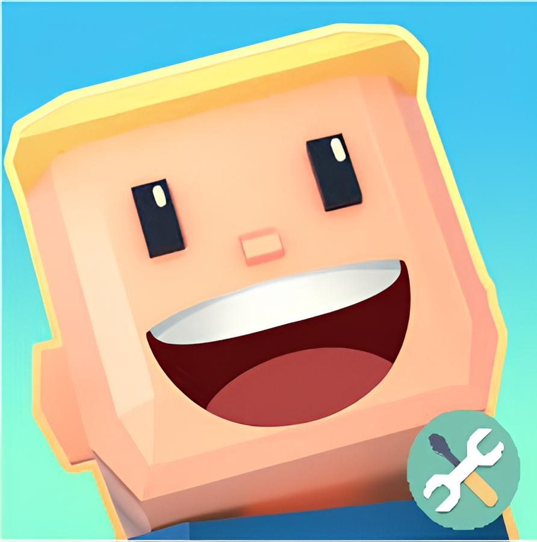
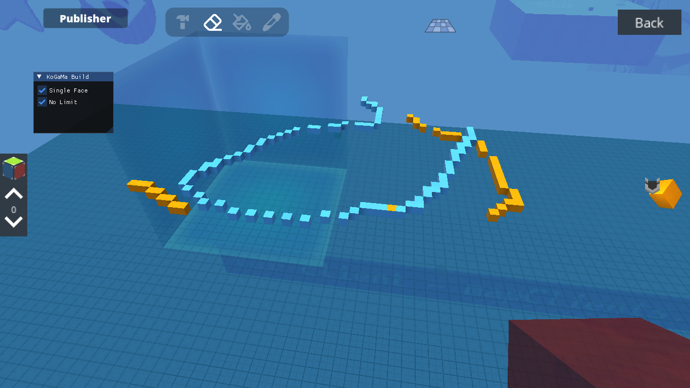

# KoGaMaTools.Native

A native tool developed in C++ designed to inject extra features and modifications into the KoGaMa (Standalone) game client. The project utilizes IL2CPP instrumentation to interact directly with internal game classes, offering features such as "No Limit" for building and single-face painting.

## 🛡 Badges

## 🚧 Project Status

The project is under active development (develop `branch`). New features and metadata are being mapped continuously.

## 📋 Tabela de Conteúdos

- [About](#kogamatoolsnative)
- [Features](#-features)
- [Demonstration](#-application-demonstration)
- [Prerequisites](#-prerequisites)
- [How to Run](#-how-to-run)
- [Technologies Used](#-techonologies-used)
- [Contribution](#-contribution)
- [Author](#-author)
- [License](#-license)

## 🚀 Features

The project injects a DLL into the game process and presents an Overlay menu using ImGui and DirectX 11.

* **In-Game Menu**: A graphical interface accessible within the game to toggle functions in real-time.
* **No Limit**: Removes the game's building restrictions.
    * Ignores cube count limits (BoxCountConstraint).
    * Ignores dynamic area limits (DynamicBoxConstraint).
* **Single Paint Face**: Modifies the painting tool to allow painting a single face of a cube rather than the entire cube or adjacent areas.
* **Multi-Region Support**: Automatic detection of the server region (BR, WWW, Friends) to load the correct metadata.

## 📷 Application Demonstration

## ⚙️ Prerequisites

To compile and run the project, you will need:

* **Operating System**: Windows (x64).
* **IDE**: Visual Studio 2022 (C++ v145 support).
* **Dependencies**:
    * The project relies on generated IL2CPP metadata (`Tools.Il2Cpp.ICalls.dat`, `KoGaMaAPI.KoGaMa.dat`).
    * MinHook and Kiero Libraries  (already referenced in the project).

## 🏃 How to Run

### Compilation

1.  Clone the repository.
2.  Open the solution file `KoGaMaTools.Native.slnx` in Visual Studio.
3.  Select the `Release` or `Debug` configuration and the `x64` platform.
4.  Build the project.

### Installation/Injection

After compilation, the build script (`build/publish.cmd`) organizes the output files.

1.  The generated DLL (`KoGaMaTools.Native.dll`) must be injected into the KoGaMa game process.
2.  **Important**: The DLL expects a specific folder structure to load the correct metadata based on the game executable's region. Ensure that `minhook.x64.dll` and the metadata folder (e.g., `BR/`, `WWW/`) are in the working directory expected by the injector.

## 🛠 Technologies used

* **[C++ 20](https://en.cppreference.com/w/cpp/20)** - Main programming language.
* **[MinHook](https://github.com/TsudaKageyu/minhook)** - Library for hooking Windows API functions.
* **[Kiero](https://github.com/Rebzzel/kiero)** - Universal hook for graphical interfaces (DirectX 11).
* **[ImGui](https://github.com/ocornut/imgui)** - Library for creating the user interface (Overlay).
* **IL2CPP Interop** - System for interacting with Unity's IL2CPP backend.

## 🤝 Contribuição

Contribuições são bem-vindas! Sinta-se à vontade para abrir issues relatando problemas ou pull requests com melhorias.

1.  Fork the project.
2.  Create your Feature Branch (`git checkout -b feature/MyFeature`)
3.  Commit your changes (`git commit -m 'Adding new feature'`)
4.  Push to the Branch (`git push origin feature/MyFeature`)
5.  Open a Pull Request.

## 👤 Author

* **MauryDev** - *Initial Development* - [GitHub Profile](https://github.com/MauryDev)

## 📝 License

This project is licensed under the MIT License - see the [LICENSE.txt](LICENSE.txt) file for details.
