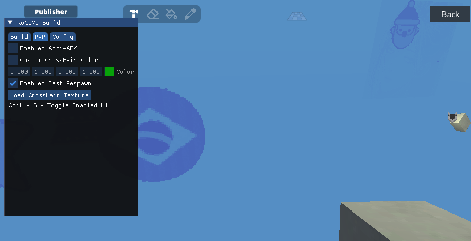
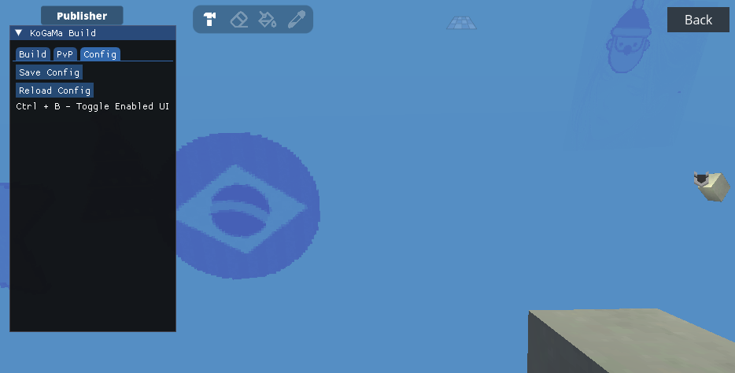
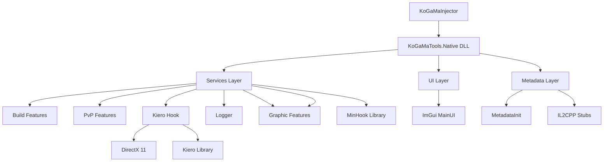

# KoGaMaTools.Native

A native tool developed in C++ designed to inject extra features and modifications into the KoGaMa (Standalone) game client. The project utilizes IL2CPP instrumentation to interact directly with internal game classes, offering features such as "No Limit" for building, single-face painting, and advanced building enhancements.

## 🛡 Badges

## 🚧 Project Status

The project is under active development on the `develop` branch. New features and metadata mappings are being continuously added and refined.

## 📋 Table of Contents

- [About](#kogamatoolsnative)
- [Features](#-features)
- [Demonstration](#-application-demonstration)
- [Project Structure](#-project-structure)
- [Prerequisites](#-prerequisites)
- [How to Run](#-how-to-run)
- [Technologies Used](#-technologies-used)
- [Contribution](#-contribution)
- [Acknowledgments](#-acknowledgments)
- [Author](#-author)
- [License](#-license)

## 🚀 Features

The project injects a DLL into the game process and presents an Overlay menu using ImGui and DirectX 11.

### Build Mode Features

* **In-Game Menu**: A graphical interface accessible within the game to toggle functions in real-time.
    * Press `Ctrl + B` to toggle the UI visibility.
* **No Limit**: Removes the game's building restrictions.
    * Ignores cube count limits (BoxCountConstraint).
    * Ignores dynamic area limits (DynamicBoxConstraint).
* **Single Paint Face**: Modifies the painting tool to allow painting a single face of a cube rather than the entire cube or adjacent areas.
* **Custom Grid**: Allows custom grid size configuration for precise building placement and manipulation.
* **Edit Mode Speed**: Adjustable movement speed multiplier in edit mode for faster or slower navigation.
* **Rotation Step**: Customizable rotation step angles for more precise object orientation control.
* **Destructibles Unlock**: Unlocks access to destructible objects that are normally restricted.
* **Blue Mode Toggle**: Toggle the Blue Mode visual effect on demand.
* **Unlimited Config**: Advanced configuration options for extending building capabilities beyond standard limits.

### PvP Mode Features

* **Anti-AFK**: Prevents automatic idle kick by disabling the idle detection system.
* **Custom Crosshair Color**: Customize the crosshair color to suit your preference.
* **Custom Crosshair Texture**: Replace the default crosshair with custom textures for improved visibility.
* **Fast Respawn**: Speeds up the respawn timer for quicker re-engagement in PvP matches.

### General Features

* **Multi-Region Support**: Automatic detection of the server region (BR, WWW, Friends) to load the correct metadata.
* **Chat Command**: A system that allows executing commands through the in-game chat, providing quick access to features without opening the menu.
* **Configuration**: The project includes a configuration system that allows users to save and load their settings, ensuring that preferences are retained across gaming sessions.
* **Info**: Displays real-time information about the current game state, such as player XP, models count, and more.

## 📷 Application Demonstration

## 📁 Project Structure

### Root Directory

* **`/src`**: Contains the source code files.
    * **`/img`**: Image assets used in the documentation.
    * **`/dll`**: The generated DLL files after the build.
    * **`/metadata`**: Folder where the metadata files are located (BR, WWW, etc.).
* **`build/`**: Contains scripts and files related to project building and publishing.
* **`LICENSE.txt`**: The license file for the project.
* **`README.md`**: This readme file.

```mermaid
graph TD

A[KoGaMaInjector] --> B[KoGaMaTools.Native DLL]

B --> C[Services Layer]
B --> D[UI Layer]
B --> E[Metadata Layer]

C --> C1[Build Features]
C --> C2[PvP Features]
C --> C3[Kiero Hook]
C --> C4[Logger]
C --> C5[PathHelper]
C --> C5[Graphic Features]

D --> D1[ImGui MainUI]

E --> E1[MetadataInit]
E --> E2[IL2CPP Stubs]

C3 --> F[DirectX 11]
C3 --> G[Kiero Library]
C --> H[MinHook Library]
```

## ⚙️ Prerequisites

To compile and run the project, you will need:

* **Operating System**: Windows 10 or later (64-bit).
* **IDE**: Visual Studio 2022 or later with C++ workload installed.
* **Compiler**: MSVC v145 (C++ v145 support).
* **Dependencies**:
    * The project relies on generated IL2CPP metadata files:
        * `Tools.Il2Cpp.ICalls.dat`
        * `KoGaMaAPI.KoGaMa.dat`
    * MinHook library (included in the project).
    * Kiero library (included in the project).
    * ImGui library (included as dependency).
    * DirectX 11 SDK (included with Windows SDK).
* **Shared Project**: Il2CppInteropCpp (referenced as shared project).

## 🏃 How to Run

### Compilation

1. Clone the repository.
2. Open the solution file `KoGaMaTools.Native.sln` in Visual Studio 2022.

3. Ensure all dependencies are resolved (vcpkg manifest mode is enabled).

4. Select **Release** configuration and **x64** platform (Debug is also available for testing).

5. Build the solution using __Build > Build Solution__ or press `Ctrl + Shift + B`.

### Compilation Output

After a successful build:
- The main DLL: `KoGaMaTools.Native\x64\Release\Native\KoGaMaTools.Native.dll`
- Supporting DLL: `KoGaMaTools.Native\x64\Release\Metadata\KoGaMaAPI.Metadata.dll`

### Code Guidelines

* Follow C++20 standards and modern practices.
* Maintain consistent code formatting and style.
* Add comments for complex logic.
* Test thoroughly before submitting a PR.
