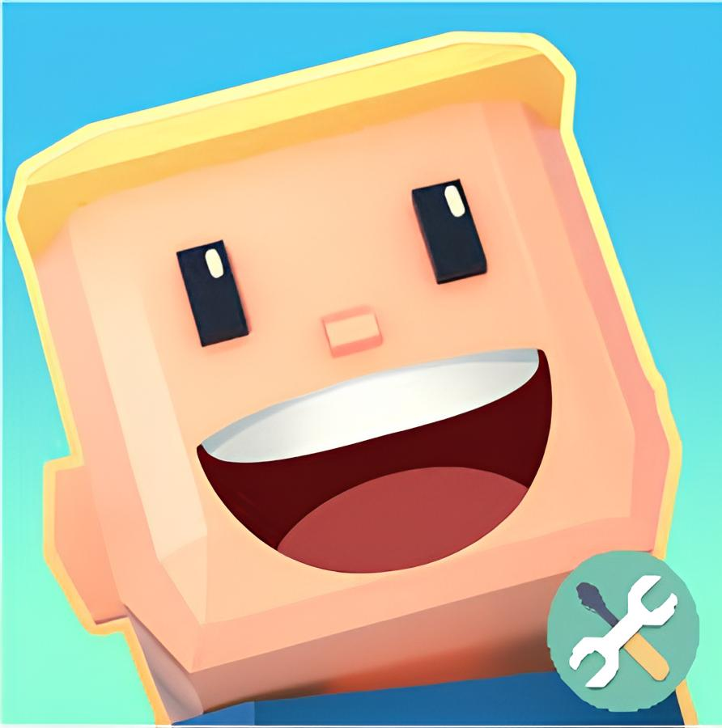
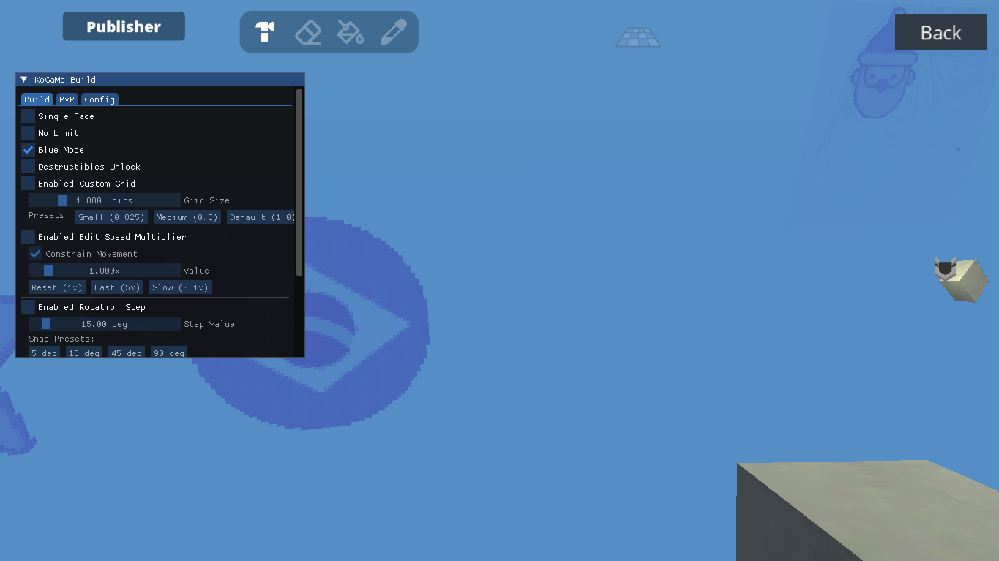

# KoGaMaTools.Native

A native tool developed in C++ designed to inject extra features and modifications into the KoGaMa (Standalone) game client. The project utilizes IL2CPP instrumentation to interact directly with internal game classes, offering features such as "No Limit" for building, single-face painting, and advanced building enhancements.

## 🛡 Badges

## 🚧 Project Status

The project is under active development (develop `branch`). New features and metadata are being mapped continuously.

## 📋 Table of Contents

- [About](#kogamatoolsnative)
- [Features](#-features)
- [Demonstration](#-application-demonstration)
- [Prerequisites](#-prerequisites)
- [How to Run](#-how-to-run)
- [Technologies Used](#-techonologies-used)
- [Contribution](#-contribution)
- [Acknowledgments](#-acknowledgments)
- [Author](#-author)
- [License](#-license)

## 🚀 Features

The project injects a DLL into the game process and presents an Overlay menu using ImGui and DirectX 11.

### Build Mode Features

* **In-Game Menu**: A graphical interface accessible within the game to toggle functions in real-time.
    * Press `Ctrl + B` to toggle the UI visibility.
* **No Limit**: Removes the game's building restrictions.
    * Ignores cube count limits (BoxCountConstraint).
    * Ignores dynamic area limits (DynamicBoxConstraint).
* **Single Paint Face**: Modifies the painting tool to allow painting a single face of a cube rather than the entire cube or adjacent areas.
* **Custom Grid**: Allows custom grid size configuration for precise building placement and manipulation.
* **Edit Mode Speed**: Adjustable movement speed multiplier in edit mode for faster or slower navigation.
* **Rotation Step**: Customizable rotation step angles for more precise object orientation control.
* **Destructibles Unlock**: Unlocks access to destructible objects that are normally restricted.
* **Blue Mode Toggle**: Toggle the Blue Mode visual effect on demand.
* **Unlimited Config**: Advanced configuration options for extending building capabilities beyond standard limits.

### PvP Mode Features

* **Anti-AFK**: Prevents automatic idle kick by disabling the idle detection system.
* **Custom Crosshair Color**: Customize the crosshair color to suit your preference.
* **Custom Crosshair Texture**: Replace the default crosshair with custom textures for improved visibility.
* **Fast Respawn**: Speeds up the respawn timer for quicker re-engagement in PvP matches.

### General Features

* **Multi-Region Support**: Automatic detection of the server region (BR, WWW, Friends) to load the correct metadata.

## 📷 Application Demonstration

## ⚙️ Prerequisites

To compile and run the project, you will need:

* **Operating System**: Windows (x64).
* **IDE**: Visual Studio 2022 (C++ v145 support).
* **Dependencies**:
    * The project relies on generated IL2CPP metadata (`Tools.Il2Cpp.ICalls.dat`, `KoGaMaAPI.KoGaMa.dat`).
    * MinHook and Kiero Libraries (already referenced in the project).

## 🏃 How to Run

### Compilation

1.  Clone the repository.
2.  Open the solution file `KoGaMaTools.Native.slnx` in Visual Studio.
3.  Select the `Release` or `Debug` configuration and the `x64` platform.
4.  Build the project.

### Installation/Injection

After compilation, the build script (`build/publish.cmd`) organizes the output files.

1.  The generated DLL (`KoGaMaTools.Native.dll`) must be injected into the KoGaMa game process.
2.  **Important**: The DLL expects a specific folder structure to load the correct metadata based on the game executable's region. Ensure that `minhook.x64.dll` and the metadata folder (e.g., `BR/`, `WWW/`) are in the working directory expected by the injector.

## 🛠 Technologies used

* **[C++ 20](https://en.cppreference.com/w/cpp/20)** - Main programming language.
* **[MinHook](https://github.com/TsudaKageyu/minhook)** - Library for hooking Windows API functions.
* **[Kiero](https://github.com/Rebzzel/kiero)** - Universal hook for graphical interfaces (DirectX 11).
* **[ImGui](https://github.com/ocornut/imgui)** - Library for creating the user interface (Overlay).
* **IL2CPP Interop** - System for interacting with Unity's IL2CPP backend.

## 🤝 Contribution

Contributions are welcome! Feel free to open issues reporting problems or pull requests with improvements.

1.  Fork the project.
2.  Create your Feature Branch (`git checkout -b feature/MyFeature`)
3.  Commit your changes (`git commit -m 'Adding new feature'`)
4.  Push to the Branch (`git push origin feature/MyFeature`)
5.  Open a Pull Request.

## 👏 Acknowledgments

Special thanks to the following for testing and feedback:

* **Snowy** - *Testing and Feedback*

## 👤 Author

* **MauryDev** - *Initial Development* - [GitHub Profile](https://github.com/MauryDev)

## 📝 License

This project is licensed under the MIT License - see the [LICENSE.txt](LICENSE.txt) file for details.
