# KoGaMaTools DLL Initialization Architecture

The following diagram describes the DLL lifecycle, from process injection to the final configuration of the UI and services.

```mermaid
graph LR
    %% DLL Entry Point
    Start((DLL Injection)) --> DllMain[DllMain: DLL_PROCESS_ATTACH]
    DllMain --> Thread[CreateThread: MainThread]

    subgraph Init["Initialization & Wait Phase"]
        Thread --> PathHelper[PathHelper: Define paths/region]
        PathHelper --> WaitGame{Loop: DLLs loaded?}
        WaitGame -- No --> WaitGame
        WaitGame -- Yes --> LoadDeps[Load MinHook & .dat Metadata]
    end

    subgraph Core["Core & Hooks"]
        LoadDeps --> Kiero[KieroUI: Init Hook]
        Kiero --> MetaInstall[KoGaMaAPI: Metadata]
        MetaInstall --> MHInit[MH_Initialize: MinHook]
    end

    subgraph DI["Dependency Injection (DI)"]
        MHInit --> DI_Registry[InstallMultiple]
        DI_Registry --> S1[MainComponent]
        DI_Registry --> S2[LoggerService]
        DI_Registry --> S3[MainUI]
        DI_Registry --> S4[Mod Services]
        
        S1 & S2 & S3 & S4 --> InitAll[app.InitAll]
    end

    subgraph UI["UI Configuration"]
        InitAll --> GetUI[Retrieve MainUI Instance]
        GetUI --> SetupUI1[Group 0: Editing]
        SetupUI1 --> SetupUI2[Group 1: Gameplay]
        SetupUI2 --> SetupUI3[Group 2: Settings]
        SetupUI3 --> Finalize[Config: SetupConfigurables]
    end

    Finalize --> End((Ready for Use))

    %% Estilização
    style Start stroke:#333,stroke-width:2px
    style DI_Registry stroke:#333,stroke-width:2px
    style WaitGame stroke:#d4a017,stroke-width:2px
    style S4 stroke:#16a085

```

## Technical Component Breakdown:

- Entry Point (DllMain): Spawns a dedicated thread (MainThread) to avoid blocking the host process's main execution flow during the loading phase.

- Game Synchronization: The thread performs a polling loop to ensure vital Unity engine modules (GameAssembly.dll and UnityPlayer.dll) are fully mapped into memory before attempting any function hooking.

- Metadata Abstraction: Uses external .dat files to dynamically resolve Il2Cpp function addresses. This layer of abstraction allows the mod to remain compatible across different game versions without recompiling the core logic.

- DI Container (Dependency Injection): The architecture relies on a centralized DIContainer singleton. Using InstallMultiple, it manages the lifecycle and dependencies of all services, ensuring that components like LoggerService or ConfigService are available globally.

- Modular UI Setup: The SetupUI template function allows for a decoupled design. Services are injected into specific UI categories (tabs or groups) based on their responsibility, making the interface easily extensible.